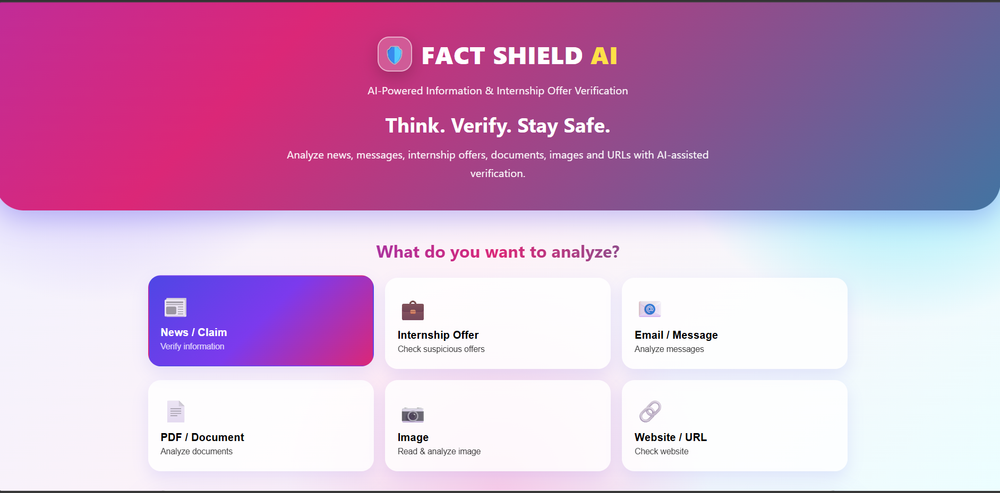

# FACT SHIELD AI 🛡️

### Think. Verify. Stay Safe.

Fact Shield AI is an AI-powered information and internship verification platform designed to help users identify potential misinformation, scams, suspicious internship offers, phishing-like messages, and online safety risks.

It can analyze news, messages, internship offers, emails, PDFs, images, and URLs and provide risk indicators, confidence levels, explanations, and verification recommendations.

---

## 📸 User Interface



---

## ✨ Features

- 📰 News & Information Analysis
- 💼 Internship Offer Verification
- 📧 Email & Message Analysis
- 📄 PDF Analysis
- 🖼️ Image Analysis
- 🔗 URL Analysis
- 🤖 AI-assisted Risk Analysis
- ⚠️ Warning Indicator Detection
- 📊 Risk Score
- 🔍 Verification Recommendations
- 🗄️ Analysis History
- 💾 SQLite Database

---

## 🛠️ Technologies Used

### Frontend
- HTML
- CSS
- JavaScript

### Backend
- Python
- FastAPI
- Uvicorn

### Database
- SQLite
- SQLAlchemy

### AI / Analysis
- Text pattern analysis
- OCR/image analysis
- AI-assisted verification

---

## 📁 Project Structure

```text
FACT_SHIELD_AI/
│
├── backend/
│   ├── main.py
│   ├── database.py
│   ├── model.py
│   ├── text_analyzer.py
│   ├── image_analyzer.py
│   ├── internship_detector.py
│   ├── pdf_analyzer.py
│   └── url_analyzer.py
│
├── frontend/
│   ├── index.html
│   ├── script.js
│   ├── style.css
│   └── static/
│
├── reports/
│
├── screenshot/
│   └── Screenshot.png
│
├── uploads/
│
├── .env
├── .gitignore
└── README.md
